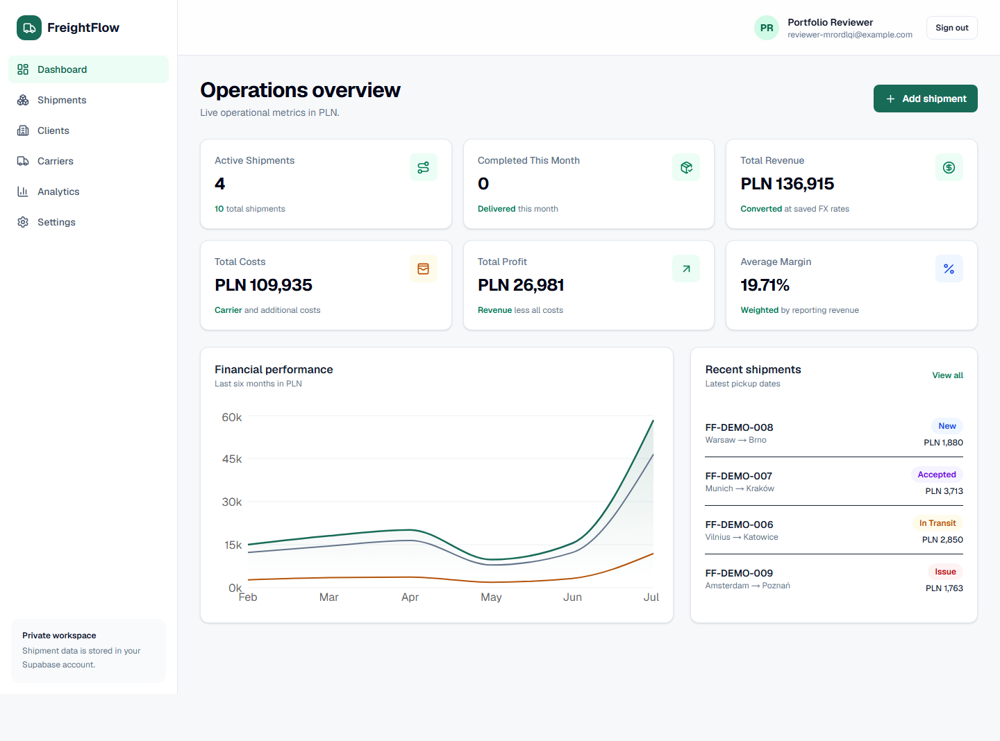
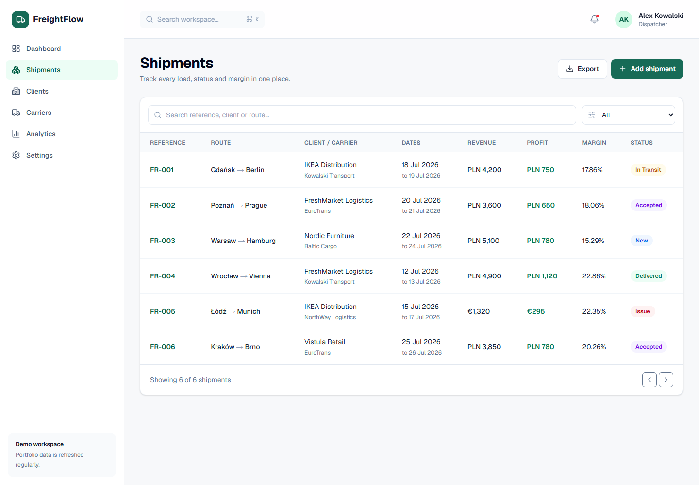
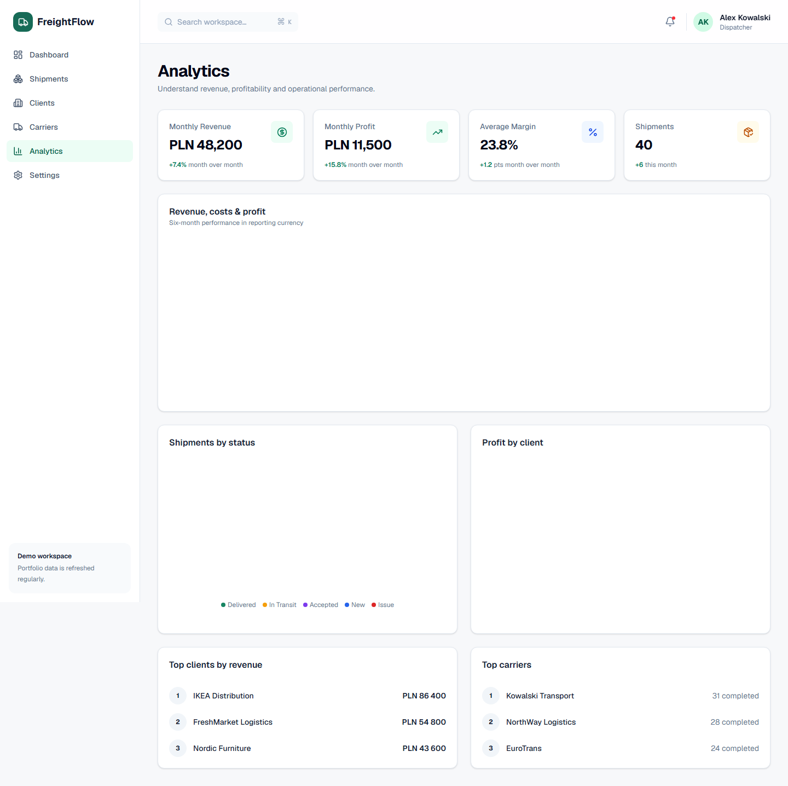

# FreightFlow

FreightFlow is a portfolio-grade transport management dashboard for dispatchers and freight teams. It centralizes shipments, clients, carriers and profitability in one clear operational workspace.

## Features

- Supabase email/password authentication and protected routes
- Shipment management with status tracking, search and filters
- Client and carrier directories with operational metrics
- Automatic profit, margin and reporting-currency calculations
- Dashboard KPIs and six-month Recharts analytics
- PostgreSQL schema with strict row-level security
- Responsive desktop and mobile interface
- Unit, browser and CI quality checks

## Tech stack

Next.js 16, TypeScript, Tailwind CSS 4, Supabase/PostgreSQL, Recharts, React Hook Form, Zod, Vitest and Playwright.

## Getting started

```bash
npm install
cp .env.example .env.local
npm run dev
```

Open `http://localhost:3000`. Without Supabase environment variables the app starts in a read-only portfolio demo mode with realistic freight data.

## Supabase setup

1. Create a Supabase project.
2. Apply `supabase/migrations/202607120001_initial_schema.sql` using the Supabase CLI or SQL editor.
3. Add the project URL and anonymous key to `.env.local`.
4. Add `http://localhost:3000/auth/callback` and the production callback URL to the Auth redirect allow list.
5. Create the optional demo account in Auth, then seed business records using its UUID. Never commit its password.

```env
NEXT_PUBLIC_SUPABASE_URL=
NEXT_PUBLIC_SUPABASE_ANON_KEY=
```

## Quality checks

```bash
npm run lint
npm run typecheck
npm test
npm run build
npm run test:e2e
```

## Data security

Every business record is owned by a Supabase Auth user. PostgreSQL row-level security isolates profiles, clients, carriers and shipments. Cross-user client/carrier relationships are rejected, while restrictive foreign keys preserve historical shipment integrity.

## Deployment

Deploy to Vercel, configure both public Supabase environment variables, then register the Vercel callback URL in Supabase Auth. GitHub Actions validates linting, types, unit tests and the production build.

## Demo

Live demo: [freight-flow-tau.vercel.app](https://freight-flow-tau.vercel.app)

## Screenshots



<details>
<summary>More screens</summary>




</details>

## License

MIT
